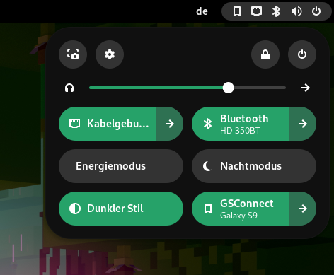

# DeepGreen-Dark

DeepGreen-Dark is a gnome shell theme based on the colour scheme that I personally made and applied using [Gradience](https://github.com/GradienceTeam/Gradience), a Libadwaita customizing tool.

Here is a screenshot of what the theme looks like.

## Installation

1. Clone this repository 

2. Move whole folder to ~/.themes

3. In Gnome Tweaks, change shell theme to DeepGreen-Dark

## Note
This theme is a fork of the [Pretty in Purple](https://github.com/Juno-ko/Pretty-In-Purple) theme, so there might be some areas that are still in purple. Should you spot something, feel free to commit.
